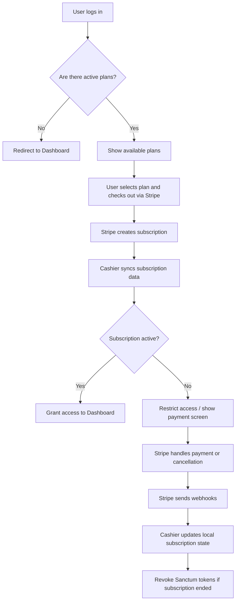

## Subscriptions

The platform uses **Stripe** and **Laravel Cashier** to manage subscription plans, payments, and recurring billing.

---

### Overview

- The **admin user** can access the platform **without needing a plan**.  
- **Regular users** must be assigned to a plan if any plans exist.  
- If there are **no active plans** defined in the system, all users are redirected directly to the **dashboard** (no subscription required).  
- When at least one plan is active, users must select or be assigned a plan before they can access the dashboard.  

---

### Plans Management

- Plans are created and managed from the **Admin Panel**.  
- When a plan is created in the platform, a corresponding **product and price** are automatically created in **Stripe**.  
- Each plan includes:
  - Name  
  - Billing interval (monthly, yearly, etc.)  
  - Amount  
  - Features

**Stripe** handles:
- Payment collection  
- Recurring billing  
- Renewals and cancellations  

The platform automatically synchronizes these updates via **Stripe webhooks**, handled by Laravel Cashier.

---

### Webhooks

Add a webhook endpoint in your **Stripe Dashboard → Developers → Webhooks**:

```
POST https://your-domain.com/stripe/webhook
```

Enable the following events:

- `customer.subscription.created`  
- `customer.subscription.updated`  
- `customer.subscription.deleted`  
- `invoice.payment_succeeded`  
- `invoice.payment_action_required`  
- `customer.updated`  
- `customer.deleted`  
- `payment_method.automatically_updated`

---

### Subscription Lifecycle

| Stage | Description |
|--------|-------------|
| **Plan Creation** | Admin creates a plan → Stripe product and price are created automatically. |
| **Subscription Start** | User subscribes → Stripe manages checkout and payment. |
| **Renewal / Billing** | Stripe automatically renews subscriptions based on the plan interval. |
| **Cancellation / End** | Stripe sends `customer.subscription.deleted` → the system revokes all API tokens and disables premium access. |

---

### Developer Setup

1. **Configure Stripe and Cashier**
   ```bash
   STRIPE_KEY=pk_test_...
   STRIPE_SECRET=sk_test_...
   STRIPE_WEBHOOK_SECRET=whsec_...

   CASHIER_CURRENCY=eur
   CASHIER_CURRENCY_LOCALE=it_IT
   CASHIER_LOGGER=payments
   ```

2. **Install and migrate Cashier**
   ```bash
   composer require laravel/cashier
   php artisan migrate
   ```

3. **Webhook route**
   Cashier already includes one by default:
   ```php
   Route::post('/stripe/webhook', [\Laravel\Cashier\Http\Controllers\WebhookController::class, 'handleWebhook']);
   ```

4. **Testing locally**
   Use the [Stripe CLI](https://stripe.com/docs/stripe-cli):
   ```bash
   stripe listen --forward-to http://localhost:8000/stripe/webhook
   ```

5. **Token revocation**
   When a subscription ends (`customer.subscription.deleted`), all **Sanctum API tokens** for that user are automatically revoked for security.

---

### Notes

- **Admin users** always bypass subscription checks.  
- Subscription enforcement only applies if **one or more active plans exist**.  
- Stripe controls all billing and recurrence logic; the platform only syncs states and performs side effects (token revocation, access updates, etc.).  
- Subscription statuses (`active`, `past_due`, `canceled`, etc.) are mirrored locally via Cashier.

---

### Typical User Flow



---

**Summary:**
Admins bypass plans, users must subscribe if plans exist, and Stripe fully handles payments and renewals. When a subscription ends, the platform automatically revokes API keys and restricts access.

### Deleting plans
Plans can't be deleted directly on the admin dashboard if they have been used to create an invoice, been subscribed or have been used to create a payment link.
